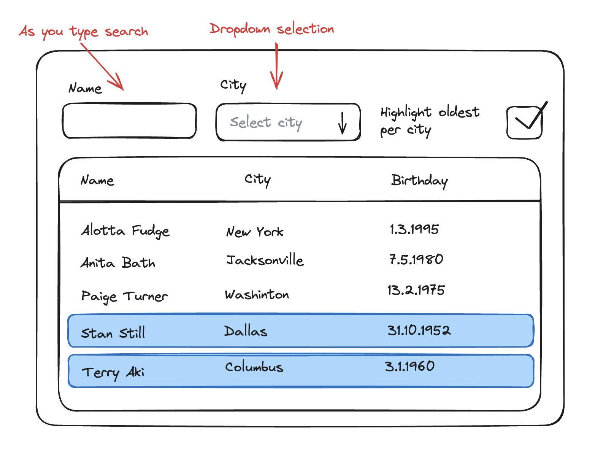

## DPS Frontend Coding Challenge

## Overview

This repository contains a very basic web application based on Typescript and React. Main application file is `App.tsx`. Node and npm are required.

## Environment Setup

Ensure you have Node.js (v14.x or later) and npm (v6.x or later) installed.  
To set up and run the application, execute the following commands:

```
npm install
npm run dev
```

The application will then be accessible at http://localhost:3000.

## Project Context

You will be enhancing a new CRM (Customer Relationship Management) software aimed at managing customer data efficiently. Your task is to develop a feature that displays a searchable list of customers.

Refer to the attached mockup image to guide your UI development 👇



## Challenge Tasks

-   **Fork this project:** Start by forking this repository
-   **UI Implementation:** Implement the user interface according to the provided design mockup.
-   **Data Integration:** Utilize the endpoint https://dummyjson.com/users to fetch user data. If no filter is applied all data is displayed.
-   **Client-side Filtering:** Implement the following filters:
    -   **Name Filter:** An input field that dynamically filters by `firstName` or `lastName` as you type.
    -   **City Filter:** A dropdown that lists all cities present in the data. Users can select a city to filter the list accordingly.
    -   **Highlight Feature:** A checkbox that when checked, highlights the oldest users within each city (use data field `city`)
    -   **Optional:** Implement a 1-second debounce on the Name Filter input. This means the application should delay the filter action until 1 second has passed without any further input from the user. This optimization helps reduce the number of processing calls, enhancing performance.
-   **Submission:** After completing the challenge, email us the URL of your GitHub repository.
-   **Further information:**
    -   If there is anything unclear regarding requirements, contact us by replying to our email.
    -   Use small commits, we want to see your progress towards the solution.
    -   Code clean and follow the best practices.

\
Happy coding!


-------------------------------------------


# DPS Frontend Coding Challenge

## Overview
This repository contains a frontend web application built using **React** and **TypeScript** as part of the DPS Coding Challenge. The application features a searchable and interactive user table, ensuring an efficient and responsive user experience.

## Live Preview
Check out the live demo of the project deployed on Vercel:

🔗 **[Live Demo](https://abdelrahman-moahmed-beta.vercel.app/)**

## Environment Setup
Ensure you have **Node.js (v14.x or later)** and **npm (v6.x or later)** installed.

To set up and run the application locally, execute the following commands:

```bash
# Clone the repository
git clone https://github.com/Abdoessam0/dps-react-challenge.git

# Navigate to the project directory
cd dps-react-challenge

# Install dependencies
npm install

# Start the development server
npm run dev
```

The application will then be accessible at **http://localhost:3000**.

## Features Implemented

### Core Features
- **Dynamic User Interface**: A user-friendly UI built based on the provided mockup design.
- **User Data Integration**: Fetches and displays user data from [DummyJSON API](https://dummyjson.com/users).

### Filters & Search
- **Name Filter**: Dynamically filters users by first or last name as you type.
- **City Filter**: A dropdown that lists all cities present in the dataset for city-based filtering.
- **Highlight Oldest User**: A checkbox that highlights the oldest user in each city.
- **Debounced Search**: Implements a 1-second debounce on the name filter input for performance optimization.

### Additional Enhancements
- **Customizable Theme Colors**: Switch table header colors dynamically using preset options.
- **Responsive Design**: Ensures seamless functionality across all screen sizes.
- **Total User Count**: Displays the total number of users dynamically below the table.
- **Clear Search Field**: Provides a button to easily reset the search input.

## Technologies Used
- **ReactJS** (Frontend framework)
- **TypeScript** (For type safety and scalability)
- **Tailwind CSS** (For modern styling and responsive design)
- **Axios** (For API requests)
- **Vercel** (For deployment)

## Project Structure
```
📦 dps-react-challenge
├── 📁 src
│   ├── 📁 components  # Reusable UI components
│   ├── 📁 hooks       # Custom React hooks
│   ├── 📁 assets      # Static assets
│   ├── App.tsx       # Main application file
│   └── index.tsx     # Entry point
└── package.json      # Dependencies and scripts
```

## API Integration
The application fetches user data from **https://dummyjson.com/users**. The retrieved data is then filtered and displayed dynamically in the table based on user interactions.

## Performance Optimizations
- **Debounced search input** to reduce unnecessary re-renders.
- **Efficient state management** using React hooks.

## Deployment
This project is deployed on **Vercel**. To deploy your own version, follow these steps:
1. Push your code to a **GitHub repository**.
2. Go to [Vercel](https://vercel.com/) and import your repository.
3. Set up the build command: `npm install && npm run build`.
4. Deploy the project and get your live URL.

## Screenshots


## Happy Coding! 🚀


